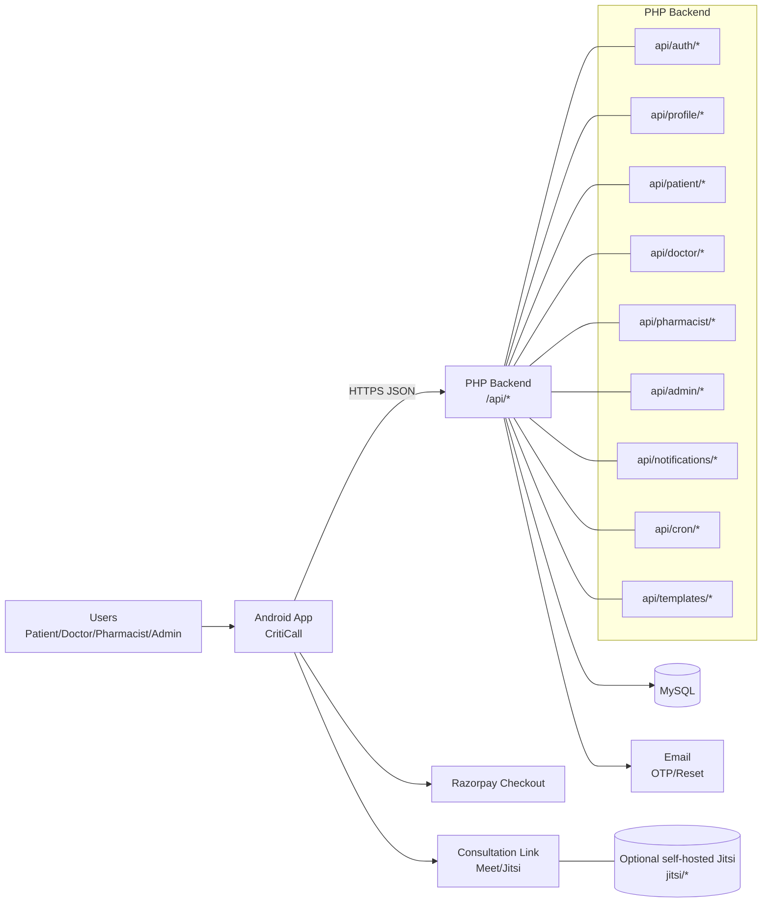

# CritiCall (Android + PHP Backend)

Multi-role healthcare platform with an **Android client** and a **PHP backend API** supporting **Patient**, **Doctor**, **Pharmacist**, and **Admin** workflows. Includes multilingual UI, appointment booking with payments, consultation handoff flows, role dashboards, notifications, and an in-app assistant layer with guided multi-step workflows (with explicit confirmation for irreversible actions).

<div align="center">


[](LICENSE)

</div>

> **Assumptions (repo-driven):**
> - Android app lives under `app/` and uses Gradle.
> - Backend is a PHP codebase rooted at `api/` with Composer dependencies (`composer.json`, `vendor/`).
> - Jitsi self-hosting artifacts exist under `jitsi/` (Docker-based).

---

## Table of Contents

- [Overview](#overview)
- [Features](#features)
- [Architecture](#architecture)
- [Tech Stack](#tech-stack)
- [Project Structure](#project-structure)
- [Backend API Structure](#backend-api-structure)
- [Getting Started](#getting-started)
  - [Prerequisites](#prerequisites)
  - [Android Setup](#android-setup)
  - [Backend Setup](#backend-setup)
  - [Environment Variables](#environment-variables)
  - [Run / Build / Test](#run--build--test)
- [Configuration](#configuration)
- [Deployment](#deployment)
- [Monitoring & Logging](#monitoring--logging)
- [Security Notes](#security-notes)
- [Troubleshooting](#troubleshooting)
- [Contributing](#contributing)
- [License](#license)

---

## Overview

CritiCall is split into two primary layers:

- **Android client**: role-specific UX for Patient, Doctor, Pharmacist, and Admin, plus assistant UI and guided workflows.
- **PHP backend API**: a foldered, role-based set of endpoints under `api/` that powers auth, profiles, appointments, notifications, inventory, and admin operations.

Consultations can use **external meeting links** returned by the API. If no link is provided, the client can fall back to a **Jitsi base URL** (configured) and generate a room name from appointment metadata.

Success is measured via:
- booking completion rate and time-to-complete,
- crash-free sessions,
- API latency/error rate on critical endpoints,
- payment success rate and reconciliation correctness.

---

## Features

### Core
- Role-based experiences: Patient, Doctor, Pharmacist, Admin.
- Appointment lifecycle: discovery → slot selection → payment handoff → confirmation → consult start → completion/resolution.
- Notifications flows for patient/doctor/pharmacist.

### Patient
- Onboarding + login + language selection.
- Profile setup for new accounts with optional medical record upload (PDF/images) or skip.
- Doctor discovery and booking.
- Prescriptions and vitals flows.
- Pharmacy discovery and medicine request flows.

### Doctor
- Dashboard + schedule.
- Availability management and slot publishing.
- Patient list + patient record access.
- Appointment completion/resolution and prescription creation.

### Pharmacist
- Inventory list + add item + quantity updates + stats.
- Requests list and mark-available flow.
- Notification list + read/dismiss.

### Admin
- User listing and detail.
- Verification update workflows.
- Basic operational stats.

### Integrations
- **Razorpay** payment handoff on Android (client-side checkout; secrets stay server-side).
- **Email OTP** templates in backend (`api/templates/*`) and mailer wiring (`api/mailer.php`).
- **Jitsi** artifacts present under `jitsi/` for self-hosting (if used).

---

## Architecture



### Component Notes
- **Android app**: role modules + assistant UI; initiates booking, payments, and consult handoffs.
- **PHP API**: role-based endpoint folders; shares common config/helpers and email templates.
- **MySQL**: persistence for users, appointments, records, inventory, and notifications (schema file exists in repo).
- **Jitsi**: optional self-hosting scaffolding under `jitsi/` (Docker-based).
- **Mail**: OTP + reset flows via templates and mailer.

---

## Tech Stack

- **Mobile:** Android (Java/Kotlin), Gradle
- **Backend:** PHP (Composer-managed dependencies)
- **Database:** MySQL (schema file included)
- **Payments:** Razorpay (Android checkout + backend order verification recommended)
- **Calls:** external meet link + optional Jitsi fallback (`JITSI_BASE_URL`)
- **Infra (optional):** Docker-based Jitsi stack under `jitsi/`
- **Email:** PHPMailer (present under `vendor/phpmailer`)

---

## Project Structure

```text
.
├─ app/                               # Android client (Gradle)
│  ├─ src/main/
│  │  ├─ AndroidManifest.xml
│  │  ├─ java/com/simats/criticall/   # app package (role modules, network, utils)
│  │  └─ res/                         # layouts, drawables, localized strings
│  └─ build.gradle
├─ api/                               # PHP backend API (role-based endpoints)
├─ jitsi/                             # optional Jitsi self-hosting (Docker artifacts)
├─ uploads/                           # server-side upload storage (doctors/patients/pharmacists)
├─ tools/                             # repo tools/scripts (if any)
├─ vendor/                            # Composer deps (firebase/phpmailer/etc.)
├─ composer.json
├─ composer.lock
├─ .htaccess
├─ symptom_model_nb_v1.json           # model artifact (repo-provided)
├─ train_symptom_nb.py                # training script (repo-provided)
├─ sehatsethu.sql / criticall.sql     # DB schema (name may vary in repo)
└─ README.md
```

> **Note:** `uploads/` is typically **runtime data** and is usually excluded in production backups/CI artifacts depending on your hosting strategy.

---

## Backend API Structure

Below is the backend structure you shared (deduplicated and formatted for README). This is the authoritative list of backend modules/endpoints in this repo.

```text
api/
├─ config.php
├─ health.php
├─ helpers.php
├─ index.php
├─ mailer.php
├─ admin/
│  ├─ stats.php
│  ├─ update_verification.php
│  ├─ users.php
│  └─ user_detail.php
├─ auth/
│  ├─ check_verification_status.php
│  ├─ forgot_password.php
│  ├─ forgot_send_otp.php
│  ├─ login.php
│  ├─ register_create_account.php
│  ├─ register_send_otp.php
│  ├─ resend_email_otp.php
│  ├─ reset_password_otp.php
│  ├─ verify_email_otp.php
│  └─ verify_reset_otp.php
├─ cron/
│  └─ appointment_reminders.php
├─ doctor/
│  ├─ appointments_list.php
│  ├─ appointment_complete.php
│  ├─ appointment_patient.php
│  ├─ appointment_resolve.php
│  ├─ availability_get.php
│  ├─ availability_save.php
│  ├─ available_slots.php
│  ├─ home_dashboard.php
│  ├─ notifications_dismiss.php
│  ├─ notifications_list.php
│  ├─ notifications_mark_read.php
│  ├─ patients_list.php
│  ├─ patient_record.php
│  └─ prescription_create.php
├─ notifications/
│  └─ list.php
├─ patient/
│  ├─ appointments_list.php
│  ├─ appointment_detail.php
│  ├─ available_slots.php
│  ├─ book_appointment.php
│  ├─ consultation_summary.php
│  ├─ dashboard.php
│  ├─ doctors.php
│  ├─ doctors_by_speciality.php
│  ├─ doctor_booking_status.php
│  ├─ doctor_detail.php
│  ├─ doctor_slots.php
│  ├─ medical_history_upload.php
│  ├─ medicines_popular.php
│  ├─ medicine_request_create.php
│  ├─ medicine_search.php
│  ├─ notifications_dismiss.php
│  ├─ notifications_list.php
│  ├─ notifications_mark_all_read.php
│  ├─ notifications_mark_read.php
│  ├─ pharmacy_detail.php
│  ├─ prescriptions_list.php
│  ├─ prescription_detail.php
│  └─ vitals_create.php
├─ pharmacist/
│  ├─ dashboard.php
│  ├─ inventory_add_item.php
│  ├─ inventory_list.php
│  ├─ inventory_set_quantity.php
│  ├─ inventory_stats.php
│  ├─ notifications_dismiss.php
│  ├─ notifications_list.php
│  ├─ notifications_mark_read.php
│  ├─ requests_list.php
│  └─ requests_mark_available.php
├─ profile/
│  ├─ doctor_get.php
│  ├─ doctor_submit.php
│  ├─ patient_get.php
│  ├─ patient_submit.php
│  ├─ patient_update_basic.php
│  ├─ pharmacist_get.php
│  ├─ pharmacist_submit.php
│  ├─ pharmacist_update_basic.php
│  └─ pro_status.php
└─ templates/
   ├─ email_otp.php
   ├─ email_reset_otp.php
   └─ email_verify_otp.php
```

---

## Getting Started

### Prerequisites

- **Android Studio** (recent stable)
- **JDK 17** (recommended for modern Android Gradle Plugin)
- **PHP 8.x** (recommended) + web server (Apache/Nginx) or local stack (XAMPP/WAMP/Laragon)
- **Composer** (for backend dependencies)
- **MySQL** (for backend DB)

> If the repo pins specific versions via Gradle wrapper or Composer constraints, follow those.

---

### Android Setup

```bash
git clone <REPO_URL>
cd <REPO_ROOT>
```

Open in Android Studio:
- **File → Open…** → select repo root
- Let **Gradle Sync** finish

---

### Backend Setup

From repo root:

```bash
cd api
```

Install PHP dependencies (if `vendor/` is not committed or you want to refresh):

```bash
composer install
```

Run backend locally using PHP built-in server (for quick dev only):

```bash
php -S 127.0.0.1:8080 -t .
```

Health check (path depends on server routing; `api/health.php` exists):

```bash
curl http://127.0.0.1:8080/health.php
```

> **Assumption:** `health.php` is directly reachable at the server docroot. If you host the backend at `/api`, adjust to `/api/health.php`.

---

### Environment Variables

This repo uses PHP config files rather than a strict `.env` contract. Use the table below as a practical checklist, then map values into `api/config.php` (and any mailer config) based on your hosting setup.

| Key | Layer | Required | Example | Where to set |
|---|---|:---:|---|---|
| `API_BASE_URL` | Android | ✅ | `https://your-domain.com/api/` | Android `ApiConfig.kt` or `BuildConfig` |
| `DB_HOST` | Backend | ✅ | `localhost` | `api/config.php` |
| `DB_NAME` | Backend | ✅ | `criticall` | `api/config.php` |
| `DB_USER` | Backend | ✅ | `root` | `api/config.php` |
| `DB_PASS` | Backend | ✅ | `password` | `api/config.php` |
| `MAIL_HOST` | Backend | ⛔* | `smtp.gmail.com` | `api/mailer.php` |
| `MAIL_USER` | Backend | ⛔* | `no-reply@...` | `api/mailer.php` |
| `MAIL_PASS` | Backend | ⛔* | `app-password` | `api/mailer.php` |
| `JITSI_BASE_URL` | Android | ⛔ | `https://meet.jit.si/` | Android `BuildConfig` |
| `RAZORPAY_KEY_ID` | Android | ✅* | `rzp_test_...` | Android `BuildConfig` |
| `RAZORPAY_KEY_SECRET` | Backend | ✅* | *(server-side)* | backend order creation/verification |

\* Required only if you use email OTP flows and/or payments end-to-end.

---

### Run / Build / Test

#### Android (CLI)

Debug APK:
```bash
./gradlew :app:assembleDebug
```

Install to a connected device:
```bash
./gradlew :app:installDebug
```

Release:
```bash
./gradlew :app:assembleRelease
./gradlew :app:bundleRelease
```

Tests (if present):
```bash
./gradlew test
```

#### Backend (local)

Composer install:
```bash
composer install
```

PHP built-in server:
```bash
php -S 127.0.0.1:8080 -t api
```

Smoke test:
```bash
curl http://127.0.0.1:8080/health.php
```

---

## Configuration

- **Android**
  - `app/build.gradle`: dependencies, build types, BuildConfig fields, signing.
  - `AndroidManifest.xml`: permissions and activity declarations.
  - `res/values*/`: translations and themes.

- **Backend**
  - `api/config.php`: database and shared config (repo file).
  - `api/helpers.php`: common helper functions (repo file).
  - `api/mailer.php`: email sending (repo file) with templates in `api/templates/`.
  - `.htaccess`: routing/security rules for Apache hosting.

- **Jitsi (optional)**
  - `jitsi/docker-jitsi-meet` and `jitsi-meet-cfg` indicate Docker-based self-hosting scaffolding.

---

## Deployment

### Android
- Build an **AAB** for Play Store:
```bash
./gradlew :app:bundleRelease
```
- Keep signing keys out of VCS and use CI secrets or local secure storage.

### Backend (PHP)
- Deploy the repo to an Apache/Nginx PHP host (shared hosting or VPS).
- Ensure:
  - PHP 8.x
  - Composer dependencies installed
  - MySQL reachable
  - `uploads/` writable by the web server user (if file uploads are used)
  - `.htaccess` enabled (Apache) or equivalent Nginx rules configured

**Database**
- Import schema:
```bash
mysql -u <user> -p <database> < criticall.sql
```
> Schema filename may be `sehatsethu.sql` or `criticall.sql` depending on your repo.

### Jitsi (optional)
- If you self-host Jitsi, use the docker artifacts under `jitsi/`.
- Keep Jitsi deployment isolated from API secrets (separate env files and access controls).

---

## Monitoring & Logging

- **Android:** Logcat for local debugging; consider adding crash reporting only if configured in repo.
- **Backend:** PHP error logs via your web server; log request IDs for support/debug (recommended).
- **Cron:** `api/cron/appointment_reminders.php` should be scheduled via system cron or hosting scheduler.

> If you add telemetry later (OpenTelemetry/Firebase/etc.), document the exact service, endpoints, and dashboards here.

---

## Security Notes

- **Never commit secrets:** DB passwords, SMTP passwords, Razorpay secrets, keystores.
- **Payments:** keep Razorpay signature verification server-side; Android uses publishable key only.
- **RBAC:** client-side role gating improves UX; enforce authorization on backend endpoints.
- **Uploads:** validate file type/size and store outside webroot when possible; restrict direct listing.
- **Rate limiting:** OTP and auth endpoints should be rate-limited (server / WAF).

---

## Troubleshooting

1) **Backend returns 500**
- Check PHP error logs.
- Verify DB credentials in `api/config.php`.
- Run:
```bash
composer install
```

2) **CORS / base URL mismatch**
- Ensure Android `API_BASE_URL` matches deployed API path (`/api/`).
- Confirm `api/health.php` is reachable.

3) **OTP emails not sent**
- Verify SMTP config in `api/mailer.php`.
- Check firewall/hosting restrictions on outbound SMTP.

4) **Uploads failing**
- Ensure `uploads/` exists and is writable by the web server user.
- Confirm file size limits in `php.ini` (`upload_max_filesize`, `post_max_size`).

5) **Cron not running**
- Schedule `api/cron/appointment_reminders.php` in server cron:
```bash
php /path/to/api/cron/appointment_reminders.php
```

6) **Android build issues**
- Ensure Android Studio uses JDK 17.
- Clean + rebuild:
```bash
./gradlew clean
./gradlew :app:assembleDebug
```

---

## Contributing

1) Fork and branch:
```bash
git checkout -b feat/<short-name>
```

2) Keep PRs small and reviewable.
- Include screenshots for UI changes.
- Include endpoint notes for backend changes.

3) Run checks:
```bash
./gradlew test
./gradlew :app:assembleDebug
```

Backend sanity check:
```bash
composer install
php -S 127.0.0.1:8080 -t api
```

---

## License

See [LICENSE](LICENSE).
