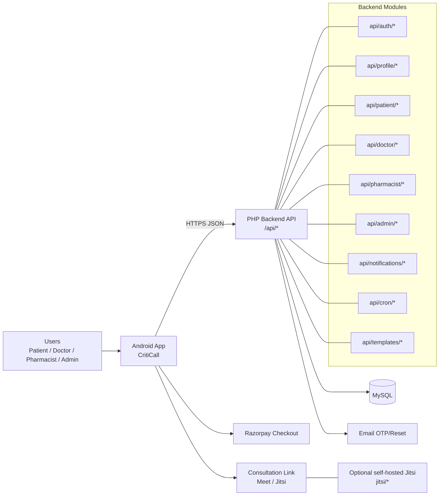

<div align="center">
  

  <h1>CritiCall</h1>

  <p>Multi-role healthcare platform with Android client and PHP backend for patient care, appointments, and pharmacy workflows.</p>

  <p>
    
    
    
    
    
    <a href="LICENSE"></a>
  </p>

  <p><strong>Built by Shashank Preetham Pendyala</strong></p>
</div>

---

## Overview

CritiCall is a production-ready healthcare platform with role-specific workflows for Patient, Doctor, Pharmacist, and Admin. The Android app drives booking, consultations, and care management, while the PHP backend powers auth, appointments, prescriptions, inventory, notifications, and administration.

---

## Table of Contents

- [Why It Matters](#why-it-matters)
- [Key Features](#key-features)
- [Roles and Permissions](#roles-and-permissions)
- [Architecture](#architecture)
- [Tech Stack](#tech-stack)
- [Project Structure](#project-structure)
- [Backend API Structure](#backend-api-structure)
- [Getting Started](#getting-started)
- [Environment Variables](#environment-variables)
- [Run, Build, Test](#run-build-test)
- [Configuration](#configuration)
- [Deployment](#deployment)
- [Monitoring and Logging](#monitoring-and-logging)
- [Security Notes](#security-notes)
- [Troubleshooting](#troubleshooting)
- [License](#license)

---

## Why It Matters

- Healthcare workflows are fragmented across roles and tools.
- Patients need fast booking and continuity of care.
- Clinics need reliable scheduling, inventory control, and accountability.

---

## Key Features

| Capability | Description |
| --- | --- |
| Role-based UX | Distinct workflows for Patient, Doctor, Pharmacist, Admin. |
| Appointment lifecycle | Booking, payment, confirmation, consultation, completion. |
| Notifications | Status changes and reminders for all roles. |
| Pharmacy flows | Inventory updates, requests, and status tracking. |
| Guided actions | Multi-step flows with confirmation for irreversible actions. |

---

## Roles and Permissions

- **Patient**: onboarding, booking, prescriptions, vitals, notifications.
- **Doctor**: schedule, patients, appointment resolution, prescriptions.
- **Pharmacist**: inventory, requests, availability updates, alerts.
- **Admin**: verification, user management, operational stats.

---

## Architecture



---

## Tech Stack

- Mobile: Android (Java/Kotlin), Gradle
- Backend: PHP (Composer)
- Database: MySQL
- Payments: Razorpay
- Calls: Meet links + optional Jitsi
- Email: PHPMailer

---

## Project Structure

```text
.
|-- app/                          # Android client (Gradle)
|   |-- src/main/
|   |   |-- AndroidManifest.xml
|   |   |-- java/com/simats/criticall/
|   |   |-- res/
|   |-- build.gradle
|-- api/                          # PHP backend API
|-- jitsi/                        # Optional Jitsi self-hosting
|-- uploads/                      # Server-side uploads
|-- tools/                        # Repo tools/scripts
|-- vendor/                       # Composer deps
|-- composer.json
|-- composer.lock
|-- .htaccess
|-- symptom_model_nb_v1.json
|-- train_symptom_nb.py
|-- criticall.sql
|-- README.md
```

---

## Backend API Structure

```text
api/
|-- config.php
|-- health.php
|-- helpers.php
|-- index.php
|-- mailer.php
|-- admin/
|-- auth/
|-- cron/
|-- doctor/
|-- notifications/
|-- patient/
|-- pharmacist/
|-- profile/
|-- templates/
```

---

## Getting Started

### Prerequisites

- Android Studio (recent stable)
- JDK 17
- PHP 8.x + web server (Apache or Nginx)
- Composer
- MySQL

---

### Android Setup

```bash
git clone <REPO_URL>
cd criticall
```

Open in Android Studio and let Gradle sync.

---

### Backend Setup

```bash
cd api
composer install
php -S 127.0.0.1:8080 -t .
```

Health check:

```bash
curl http://127.0.0.1:8080/health.php
```

---

## Environment Variables

Configure in `api/config.php` and Android build config:

| Key | Layer | Example |
| --- | --- | --- |
| `API_BASE_URL` | Android | `https://your-domain.com/api/` |
| `DB_HOST` | Backend | `localhost` |
| `DB_NAME` | Backend | `criticall` |
| `DB_USER` | Backend | `root` |
| `DB_PASS` | Backend | `password` |
| `MAIL_HOST` | Backend | `smtp.gmail.com` |
| `MAIL_USER` | Backend | `no-reply@...` |
| `MAIL_PASS` | Backend | `app-password` |
| `JITSI_BASE_URL` | Android | `https://meet.jit.si/` |
| `RAZORPAY_KEY_ID` | Android | `rzp_test_...` |
| `RAZORPAY_KEY_SECRET` | Backend | server-side |

---

## Run, Build, Test

```bash
./gradlew :app:assembleDebug
./gradlew :app:installDebug
./gradlew test

composer install
php -S 127.0.0.1:8080 -t api
```

---

## Configuration

- `api/config.php`: DB and shared backend config
- `api/helpers.php`: common helpers
- `api/mailer.php` and `api/templates/*`: email templates
- `.htaccess`: Apache routing/security
- `jitsi/*`: optional Jitsi hosting artifacts

---

## Deployment

### Android

```bash
./gradlew :app:bundleRelease
```

### Backend

```bash
composer install --no-dev --optimize-autoloader
mysql -u <user> -p <database> < criticall.sql
```

Ensure `uploads/` is writable if enabled.

---

## Monitoring and Logging

- Android: Logcat
- Backend: web server and PHP error logs
- Cron: schedule `api/cron/appointment_reminders.php`

---

## Security Notes

- Do not commit secrets (DB, SMTP, Razorpay secret, keystore).
- Keep Razorpay verification server-side.
- Enforce authorization on all role endpoints.
- Validate uploads and limit file size and type.

---

## Troubleshooting

- 500 errors: check PHP logs and DB credentials.
- Upload issues: ensure `uploads/` permissions.
- Build issues: use JDK 17 and run `./gradlew clean`.
- Health check fails: verify docroot and `health.php` path.

---

## License

MIT License. See [LICENSE](LICENSE).
